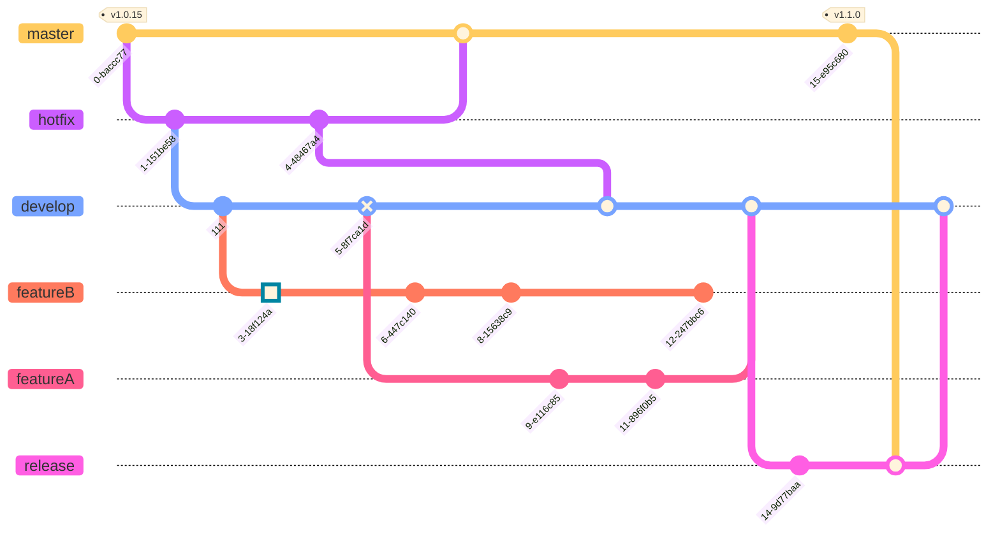

## Guideline for development
This project was created using `bun init` in bun v1.0.15.

If you not install bun, do it first (macOs/Linux):
With curl
```bash
curl -fsSL https://bun.sh/install | bash -s "bun-v1.0.15"
```
Or with npm
```bash
npm install -g bun@v1.0.15
```

Command line for dev:
```bash
bun install         # for installation
bun run dev         # for run start project in local
bun run test        # for run test case of this module
bun run bundle      # for bundle this module to publish npm
bun run format      # format with prettier
bun run check       # for check lint prettier
```

## GitGraph
Every branch which used for fix bug, create new features,... alway checkout and create a pull request when done.
Follow this diagram bellow
